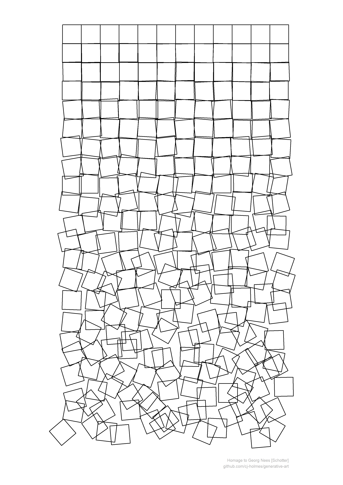

<!-- README.md is generated from README.Rmd. Please edit that file -->

```{r, include = FALSE}
knitr::opts_chunk$set(
  collapse = TRUE,
  comment = "#>"
)
```

# generative-art

A repository to document and share my attempts at generative art in R.

#### Schotter
My first attempt is at reproducing Georg Nees 1968-1970 ***Schotter*** (Gravel)
