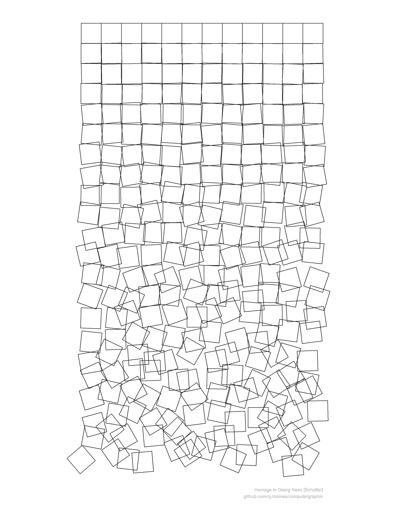
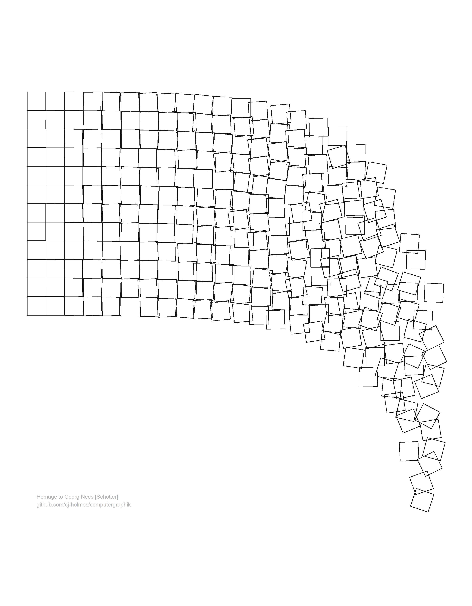
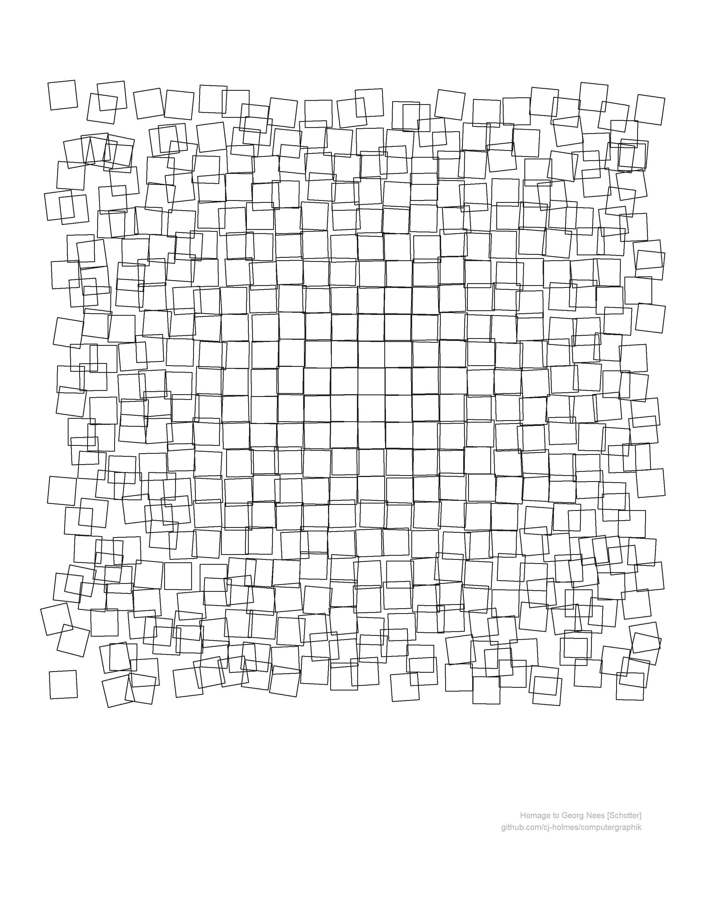

<!-- README.md is generated from README.Rmd. Please edit that file -->

# computergraphik

A repository to document and share my attempts at generative art in R.

### Schotter

My first attempt is at reproducing [Georg Nees 1968-1970
***Schotter***](https://collections.vam.ac.uk/item/O221321/schotter-print-nees-georg/)
(Gravel).

Along with some variations on the same theme…

